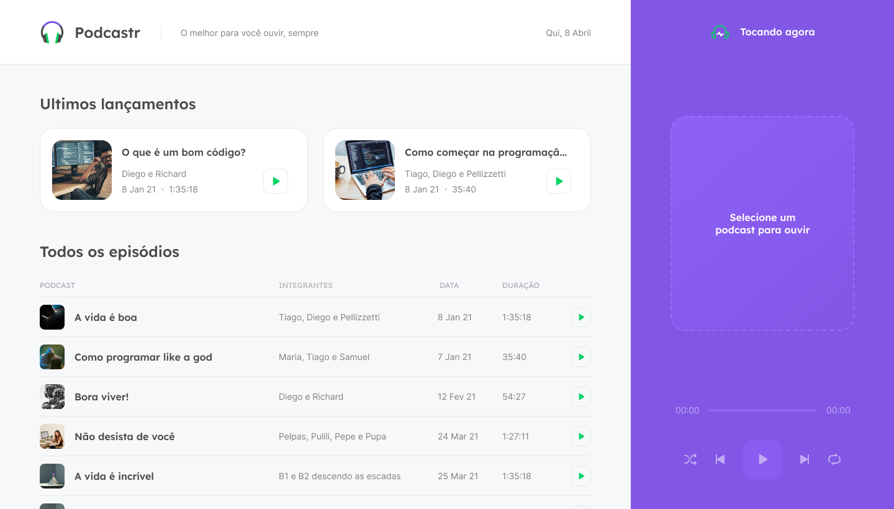
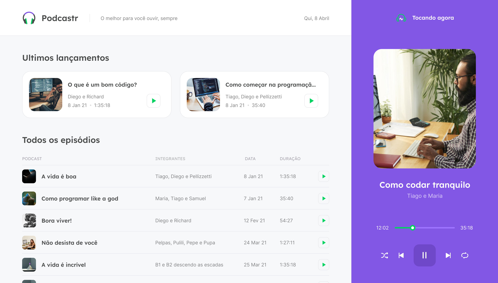

<div align="center">
  <h1>Podcastr</h1>
</div>

## UI

<div align="center">



</div>

## Technologies

- React.js
- Next.js

## Run project

First install the dependencies:

```
npm i
```

Now run the API before the frontend by running the command

```
npm run api
```

Run the project by executing the command:

```
npm run dev
```
